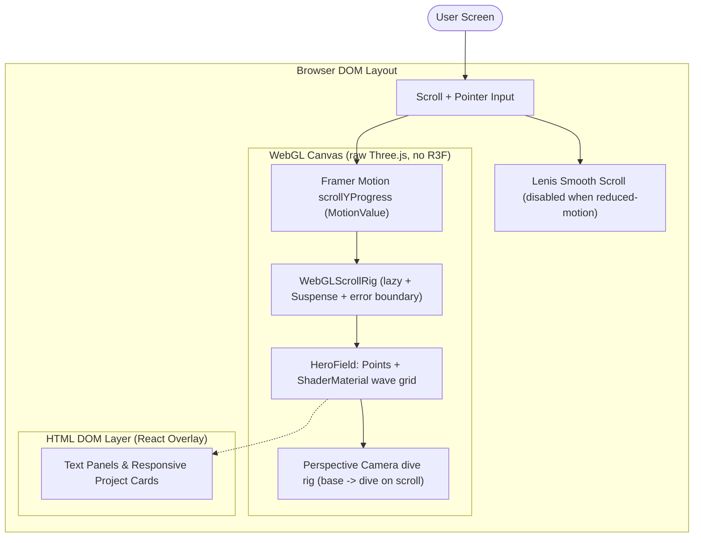

# 🚀 Vijay Barhate | Interactive 3D Engineering Portfolio

A modern, high-performance personal portfolio website built with **React**, **Three.js**, **Framer Motion**, **Lenis**, and **Tailwind CSS**. This platform serves as a visual showcase of my engineering skills, featuring a custom WebGL shader field, scroll-driven camera motion, and optimized load footprints.

---

## 📸 Portfolio Preview


🌐 **Live Website**: [https://vijaybarhate.github.io/portfolio/](https://vijaybarhate.github.io/portfolio/)

---

## ✨ Key Features

* **Custom WebGL Shader Field**: A raw Three.js particle-wave hero field (`src/components/three/HeroField.tsx`) with pointer-reactive GLSL shaders and a scroll-driven camera dive rig — no 3D framework overhead.
* **Scroll-Driven Motion**: Framer Motion `MotionValue` scroll progress drives the WebGL camera/uniforms, with Lenis smooth scrolling (auto-disabled under reduced-motion / Calm mode).
* **Dynamic Projects Grid**: Renders projects dynamically from `src/data/projects.ts`, linking directly to repositories and live deployments.
* **PDF Resume Integration**: Self-hosted resume PDFs served from `public/resume/` (including a LaTeX source `vijay_resume.tex`).
* **Performance Engineered**: Lazy-loaded WebGL (`WebGLScrollRig` suspense boundary), GPU work paused offscreen via `IntersectionObserver`, DPR capped (1 on mobile / 2 on desktop), self-hosted fonts via `@fontsource` with `font-display:swap`.
* **Tailwind Fluid Layouts**: Fully responsive grid systems optimized across mobile, tablet, and ultra-wide desktop monitors.

---

## 🧰 Tech Stack

<!-- AUTO-GENERATED:START (tech-stack from package.json — do not edit manually, run doc sync) -->
| Category | Technology | Usage |
| :--- | :--- | :--- |
| **Frontend Core** | React 18 + Vite 8 (`@vitejs/plugin-react` 5) | Modular UI components & fast HMR development |
| **Language** | TypeScript 5.5 | Strong typing & interface safety |
| **3D Rendering** | Three.js (raw `WebGLRenderer` + `ShaderMaterial`) | Custom particle-wave hero field, no R3F/Drei wrapper |
| **Motion** | Framer Motion 12 + Lenis 1.3 | Scroll-linked reveals, camera dive rig, smooth scrolling |
| **Styling** | Tailwind CSS 4 (via `@tailwindcss/postcss`) | Utility-first clean typography and sizing |
| **Icons** | lucide-react | Single icon family (`strokeWidth 1.5`) |
| **Fonts** | @fontsource (Syne 700/800, Instrument Sans 400–600, JetBrains Mono 400/500) | Self-hosted woff2, `font-display:swap` |
<!-- AUTO-GENERATED:END -->

---

## 🏗️ Rendering Architecture

The portfolio utilizes a layered UI-Canvas layout, separating interactive HTML elements from the WebGL rendering context:

<!-- AUTO-GENERATED:START (architecture from src/components/three/HeroField.tsx, src/components/three/WebGLScrollRig.tsx, src/App.tsx — do not edit manually) -->


### Architectural Breakdown
* **Layer Separation**: The WebGL canvas fills its absolute parent behind the content, while standard HTML sections scroll on top, ensuring clean touch events and interaction.
* **Scroll-Driven Camera**: Hero `scrollYProgress` (a Framer Motion `MotionValue`) drives camera position/lookAt interpolation plus wave-energy uniforms — repaint-only under reduced-motion, no autonomous loop.
* **Custom Shader Field**: A `THREE.Points` grid (130×70) with vertex/fragment GLSL (wave displacement, pointer lift, ink/accent coloring). GPU work pauses offscreen (`IntersectionObserver` + `document.hidden` guard); DPR capped at 1 (mobile) / 2 (desktop).
* **Motion Safety**: `MotionContext` + `MotionConfig reducedMotion` act as a global kill-switch; Lenis is torn down when reduced motion is active.
<!-- AUTO-GENERATED:END -->

---

## 📦 How to Run

<!-- AUTO-GENERATED:START (scripts from package.json, deploy from .github/workflows/deploy.yml, base from vite.config.ts — do not edit manually) -->
### Prerequisites
* **Node.js** v20 or newer (CI uses Node 20, `npm ci`)
* **npm**

### Available Scripts

| Command | Source | Description |
|---------|--------|-------------|
| `npm run dev` | `vite --host` | Start development server with hot reload (LAN-accessible). Open `http://localhost:5173/portfolio/` |
| `npm run build` | `tsc -b && vite build` | Type-check then production build. Output to `dist/` |
| `npm run preview` | `vite preview` | Preview the production build locally |
| `npm run lint` | `eslint .` | Lint all TS/TSX (excludes `dist/`) |

### Installation Steps

1. **Clone the Repository**
   ```bash
   git clone https://github.com/vijaybarhate/portfolio.git
   cd portfolio
   ```

2. **Install Packages**
   ```bash
   npm install
   ```

3. **Launch Local Dev Server**
   ```bash
   npm run dev
   ```
   Open `http://localhost:5173/portfolio/` in your browser (note the `/portfolio/` base path from `vite.config.ts`).

4. **Production Build**
   ```bash
   npm run build
   ```
   *Output files will be generated under the `dist/` directory.*

### Deployment
Pushes to `master` trigger `.github/workflows/deploy.yml`: `npm ci` → `npm run build` → upload `dist/` → GitHub Pages. Live at `https://vijaybarhate.github.io/portfolio/`. No environment variables required (no `.env` — static site).
<!-- AUTO-GENERATED:END -->

---

## 🧠 Challenges Faced

* **WebGL Mobile Performance bottlenecks**: Loading uncompressed GLTF models on low-power mobile devices caused high interaction latency and frame drops. We resolved this by compressing our `.glb` files using the `gltf-pipeline` utility with Draco compression, loading the mesh asynchronously inside a React `<Suspense>` wrapper with a custom HTML loader.
* **Responsive Canvas Ratios**: Fitting 3D scenes on ultra-wide desktop monitors vs. narrow mobile screens often causes models to clip at the edges. We implemented a responsive camera hook that adjusts the camera FOV (Field of View) and position coordinates based on window size.
* **Scroll Desynchronization**: Heavy DOM content scrolling on top of WebGL rendering can trigger render lag. We decoupled scroll triggers, setting GSAP's `scrub` value to `1.5` to smoothly ease transitions and eliminate visual judder.

---

## 🔮 Future Improvements

- [ ] **Interactive Model Controls**: Enable WASD key commands to control the avatar's gestures or movement in an interactive landing zone.
- [ ] **Dynamic Shader Themes**: Add custom GLSL shaders to change materials based on day/night cycles or user click-effects.
- [ ] **Multi-Language Support**: Integrate `react-i18next` to support toggling between English and other languages.

---

Built with 🖤 by [Vijay Barhate](https://github.com/vijaybarhate)
